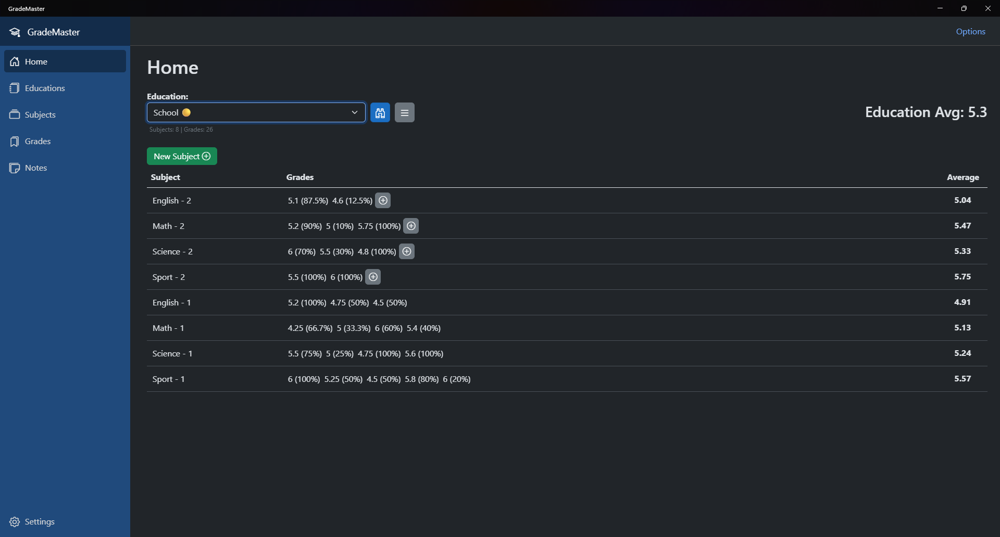
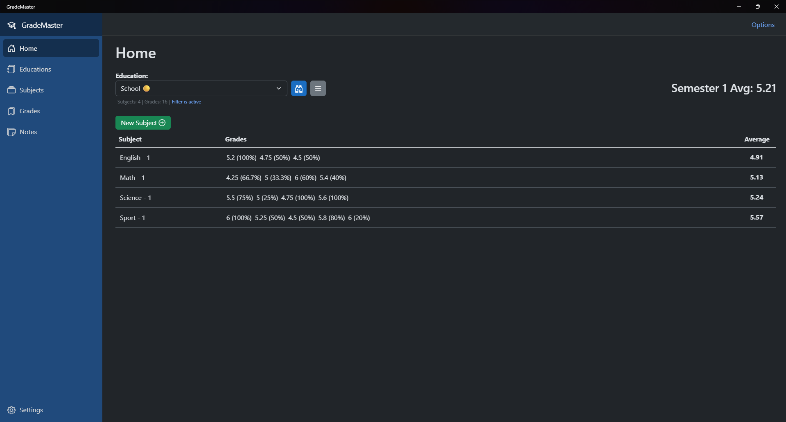
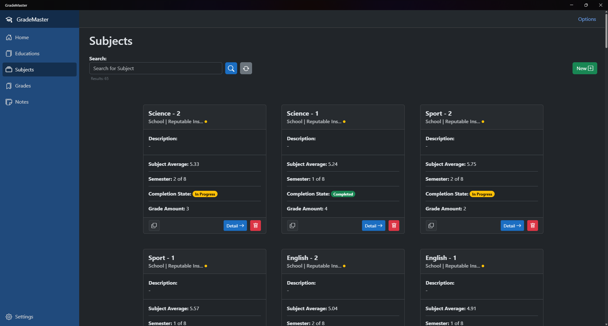
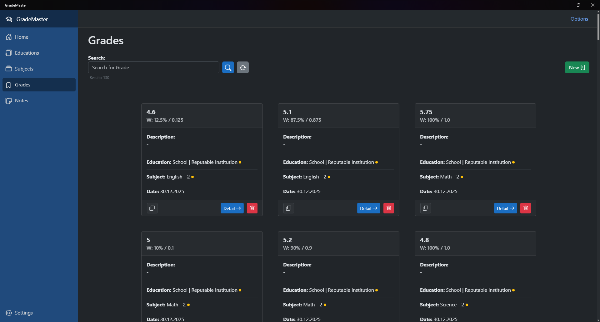
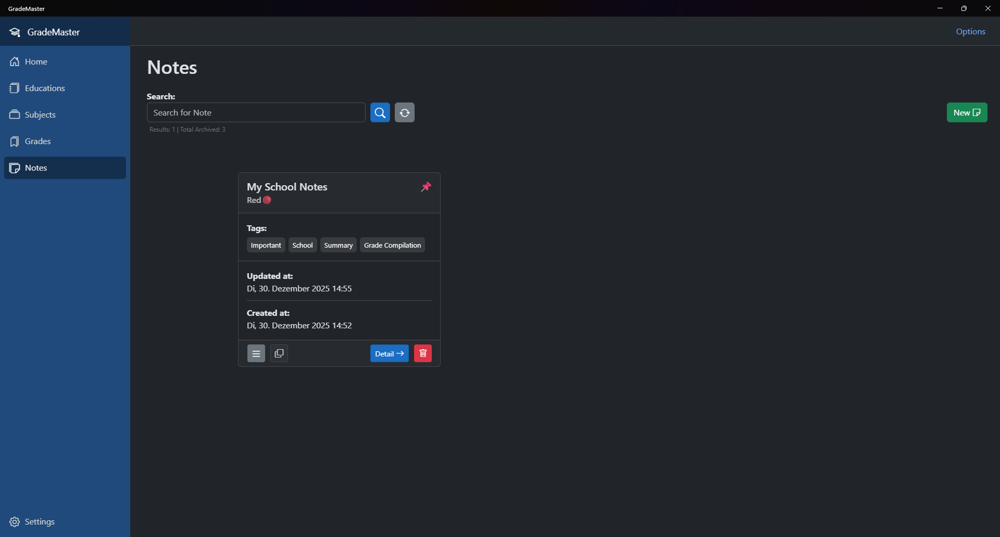
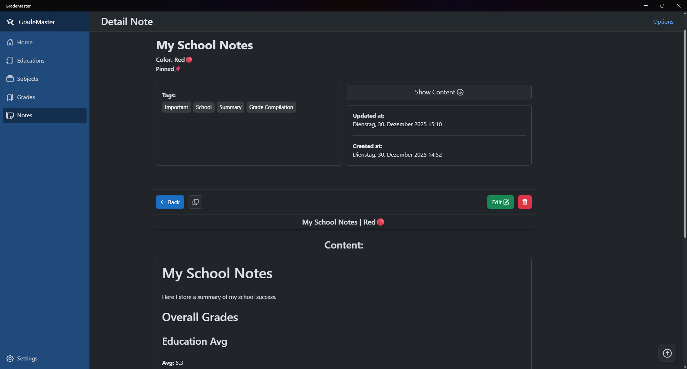

# GradeMaster

## About

GradeMaster is a Desktop based grade management tool. It allows you to manage your educations, subjects and grades.

<!--Add Screenshots of the app here.-->
## Screenshots

**Home**

<strong>View More</strong>

**Subjects**

**Grades**

**Notes**

## Technologies Used

### Desktop Client

- [.NET MAUI](https://dotnet.microsoft.com/en-us/apps/maui)
- [Blazor](https://dotnet.microsoft.com/en-us/apps/aspnet/web-apps/blazor)
- [Blazor Bootstrap](https://demos.blazorbootstrap.com/)
- [Bootstrap](https://getbootstrap.com/)
- [Inno Setup](https://jrsoftware.org/isinfo.php) (for creating the installer) 

### Backend & Database

- [Entity Framework Core](https://learn.microsoft.com/de-de/ef/core/)
- [SQLite](https://sqlite.org/)  

### .NET Version: 10.0

## Installation Guide (Installer)

Install, uninstall and update GradeMaster like any other program, with the dedicated installer found in the Releases section, of this repository.

This is also the recommended approach of installing GradeMaster.

**Note**: If you currently run GradeMaster installed form the official .zip files, make sure to have uninstalled the previous version of GradeMaster manually. This includes removing the GradeMaster directory in the `C:\Program Files` directory, desktop shortcuts, taskbar pin and the start menu shortcut.

Also important GradeMaster creates specific files and directories, that are not deleted when you delete the app.

**Prominent file/directory locations:**

- `C:\Users\[YourUser]\AppData\Local\GradeMaster`
- `C:\Users\[YourUser]\OneDrive\Apps\GradeMaster`

## Installation and Setup Guide (ZIP file)

### Installation for usage (Windows)

1. Install the Zip-File GradeMaster_[win-x64/win-arm64].zip (depending on your System architecture) from the Release Section. Make sure you install the newest available version.
2. Unpack the Zip-File in the `C:\Program Files\` directory.
3. After the installation you will see the folder containing the app. There you can copy the shortcut and paste it to the Desktop.
4. You can now launch the app from the shortcut.
5. Before you launch the application make sure you trust the binary, by checking the mark in the Properties tab when right clicking the file.  
(File location: `C:\Program Files\GradeMaster\bin\win-x64\GradeMaster.DesktopClient.exe`  
or `C:\Program Files\GradeMaster\bin\win-arm64\GradeMaster.DesktopClient.exe` for arm based systems)
6. Optional: If you like you can also copy the shortcut to the Start Menu. You can do this by copying the shortcut to this directory: `Win + R` then `%AppData%\Microsoft\Windows\Start Menu\Programs`.

### Updating Software (Windows)

1. Make sure you delete the `C:\Program Files\GradeMaster` directory. (It is recommended you make a backup of your Data by copying your GradeMaster.db file located in `C:\Users\YourUser\AppData\Local\GradeMaster\Data`. The database should remain compatible with the newer versions of the app and no data should be lost)
2. Then follow the same steps from the Installation Guide for personal use. (You do not have to copy the shortcut again. You can skip this step. Only do this step if the shortcut doesn't work anymore.)

**Disclaimer: [Updating from Version v1.x.x to v2.x.x or higher](Docs/Update_from_version_v1.x.x_to_v2.x.x.md)**

### Uninstalling the App for Users (Windows)

1. Delete the directory `C:\Program Files\GradeMaster`.
2. You can also delete the application data directory if you want to delete your data (not recommended).  
To do this delete the directories: `C:\Users\YourUser\AppData\Local\GradeMaster` and  
`C:\Users\[YourUser]\OneDrive\Apps\GradeMaster`.
3. You can also delete all of the shortcuts. Delete them, where you copied them.

## Manual installation with local build (Build from Source) (Easy/Advanced)

**Note:** .NET 10 SDK must be installed on a Windows based machine.

### Easy build and setup with included build scripts (Recommended)

1. Clone the repository or download an archive file from the releases and unpack it (Source Code archive file).
2. Navigate to the `[Your Path]\GradeMaster\Scripts\Setup` directory.
3. Open the terminal in this directory.
4. Paste the `.\CompleteBuildScript.ps1` PowerShell script command in the terminal.
5. For all the options execute it with the `-h` argument.
6. Now you can build GradeMaster however you like.
7. The output is at the `[Your Path]\GradeMaster\Src\Client\GradeMaster.DektopClient\bin\Publish` directory.

### Advanced manual build and setup of the Desktop Client

1. Clone the repository or download an archive file from the releases and unpack it (Source Code archive file).
2. Navigate to the `[Your Path]\GradeMaster\Src\Client\GradeMaster.DektopClient` directory.
3. Open the terminal in this directory.
4. Paste one of the available .NET 10 publish commands, that suit your needs in [GradeMaster Publish Commands.md](Docs/Grade%20Master%20Publish%20Commands.md).
5. Execute the command and wait till completion.
6. After that you have the option to copy the binary output to the application directory and installing the app on your machine (similar to the .zip file installation of GradeMaster)

#### If you want you can choose the Inno Setup route (requires Inno Setup to be installed)

1. Follow the previous 5 steps.
2. Navigate to the `[Your Path]\GradeMaster\Docs\InnoSetupScripts` directory.
3. There you will find various .iss files. Choose the one that suits you (architecture). Within architecture you can choose to create a full installer or a lean installer. The full installer will include all the binaries, alternatively the lean installer will copy most binary files from the output directory directly, without including them in the installer itself (optimal for personal installs and usage).
4. Execute the one of the .iss files with Inno Setup.
5. After that you have the installer file for GradeMaster ready for usage.

## Installation and setup for development

1. Clone this repository to your PC.
2. Make sure you have the necessary stuff installed in Visual Studio for .NET MAUI Blazor Hybrid applications.
3. Open the Solution located in: `..YourPath\GradeMaster\GradeMaster.slnx` in Visual Studio.
4. Let Visual Studio start up.
5. Then make sure all the packages and dependencies are loaded.
6. Next you can build the solution.
7. After you can start the application from the start button in Visual Studio. Make sure you have the Developer-Mode activated on your device.

**Note**: Visual Studio 2026 is required for GradeMaster targeting .NET 10.

## Info

### Current Release Version

### Total Downloads

### Price

GradeMaster is free to use, as of this moment.

### Versioning of the Releases

[Semantic Versioning](https://semver.org/) is used for GradeMaster releases.

### Development State

GradeMaster is actively maintained.  
New releases are generally released on a regular basis.  

> [!IMPORTANT]
> GradeMaster version 3.3.2 will presumably be the last .NET 10 based release, until a new .NET version like 11 comes out, featuring prebuilt and signed binaries.
> Version 3.3.2 of the app will be framework dependant and not require monthly update. If the newest version is still desired, [building from source](#manual-installation-with-local-build-build-from-source-easyadvanced) is recommended.

### Future Plans and Roadmap [all complete ✅]

GradeMaster is Feature complete.

#### Future Releases

GradeMaster is currently in **active maintenance** on major version **3.x.x**.

- **Version 3.x.x** is expected to be the **final major version** with new features.
- After necessary feature updates are complete, the application will be considered **feature complete**.
- Future updates will be primarily **maintenance/patch updates** (e.g., bug fixes, dependency updates: 3.0.1 to 3.0.2).
- Potential future major/minor versions could be released for **major platform changes** (e.g., updating the .NET version, dropping Windows 10 support).

### Supported Platforms

| OS      | Architecture | Supported |
|---------|--------------|-----------|
| Windows | x64          | Yes       |
| Windows | arm64        | Yes       |
| macOS   | x64          | No        |
| macOS   | arm64        | No        |
| iOS     | arm64        | No        |
| Android | arm64        | No        |

#### Info

- You also have to make sure you have the [WebView2](https://developer.microsoft.com/en-us/microsoft-edge/webview2) installed on your System.
- The [WebView2](https://developer.microsoft.com/en-us/microsoft-edge/webview2) should already be pre installed on all Windows 11 and most Windows 10 devices.

#### The Desktop GUI Client is currently limited to Windows only

- Windows versions that are supported and work (tested): Windows 11, 10

Other platforms might get Support in the future.

#### Disk Space Requirement

- It is recommended to have at least 1gb of free disk space for the application.

### Supported Languages

- English

### Supported Grading Systems

- Swiss

<!--### Console Client

The Console Client is only for testing purposes.-->

## License

This project is licensed under the Creative Commons Attribution-NonCommercial-ShareAlike 4.0 International (CC BY-NC-SA 4.0) License. For commercial use or more information, please create an Issue.

[License: CC BY-NC-SA 4.0](https://creativecommons.org/licenses/by-nc-sa/4.0/)

## Disclaimer

THIS SOFTWARE IS PROVIDED "AS IS", WITHOUT WARRANTY OF ANY KIND, EXPRESS OR IMPLIED, INCLUDING BUT NOT LIMITED TO THE WARRANTIES OF MERCHANTABILITY, FITNESS FOR A PARTICULAR PURPOSE, AND NONINFRINGEMENT. IN NO EVENT SHALL THE AUTHORS OR COPYRIGHT HOLDERS BE LIABLE FOR ANY CLAIM, DAMAGES, OR OTHER LIABILITY, WHETHER IN AN ACTION OF CONTRACT, TORT, OR OTHERWISE, ARISING FROM, OUT OF, OR IN CONNECTION WITH THE SOFTWARE OR THE USE OR OTHER DEALINGS IN THE SOFTWARE.

<!--Maybe add more disclaimers TBD-->
